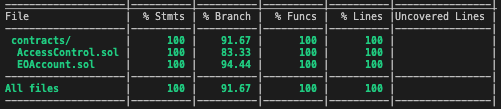

### Smart contract-based wallet

В данном проекте разработан смарт контракт, [дублирующий](https://www.argent.xyz/blog/wtf-is-account-abstraction/) некоторую логику _EO аккаунтов (Externally Owned Accounts)_:
- Получение токенов 
- Отправка токенов
- Подпись транзакций 

Дополнительно в контракте реализован функционал _восстановления (смены владельца)_ с использованием доверенных лиц.

Подразумеваются, что токены соответствуют интерфейсу [IERC20](https://docs.openzeppelin.com/contracts/2.x/api/token/erc20) стандарта [ERC20](https://ethereum.org/en/developers/docs/standards/tokens/erc-20/).

Подробности концепции __account abstraction__ можно изучить в следующих источниках:

[Part I: WTF is Account Abstraction](https://www.argent.xyz/blog/wtf-is-account-abstraction/)

[Part II: WTF is Account Abstraction](https://archive.md/OESa5#selection-243.0-246.0)

[Why EOA Wallets are a Threat to the Future of Blockchain](https://www.argent.xyz/blog/self-custody-mass-adoption/)

________

### Структура проекта

Смарт контракт был реализованный на языке _Solidity_ последней (на момент 08.11.22) версии _0.8.17_.

Использовались верифицированные контракты _OpenZeppelin_:

- _access/AccessControl.sol_
- _access/Ownable.sol_
- _token/ERC20/ERC20.sol_

Комментарии к коду были добавлены в соответствии со стандартом [_NatSpec_](https://docs.soliditylang.org/en/develop/natspec-format.html).

Стиль оформления контракта был во многом осуществлен под влиянием следующих статей:

[Solidity Style Guide (Part I)](https://medium.com/@ivanlieskov/solidity-style-guide-part-i-d0fda6041ff9)

[Solidity Style Guide (Part II)](https://medium.com/@ivanlieskov/solidity-style-guide-part-ii-23ac3b10fdfb)

________
### Функционал смены владельца доверенными лицами

Данный функционал был реализован с использованием определенных ___модификаторов___ (см.  _onlyOwner, onlyRole, toRevokeTrustedRoleAccount_ и т.д.).

Для аккаунтов введены две роли:

- _администратор_
- _доверенное лицо_

В любой момент времени и при любых ситуациях __владелец кошелька__ является __администратором__, и наоборот.

Доверенное лицо __добавляется__ администратором посредством выполнения следующей функции:

```
grantRole(TRUSTED_ACCOUNT_ROLE, accountAddress)
```

Администратор также может __убрать__ аккаунт из списка доверенных при помощи следующего запроса:

```
revokeRole(TRUSTED_ACCOUNT_ROLE, accountAddress)
```

Сама смена владельца реализована в два этапа (см. ниже).

#### Смена владельца

Первым делом подразумевается __инициализация__ восстановления, посредством выполнения любым из доверенных лиц следующей функции:

```
startRecoveryAccount(newAccountAddress)
```

Далее __каждое__ доверенное лицо должно выполнить следующий запрос:

```
voteRecoveryAccount(newAccountAddress)
```

В результате всего этого, владельцом (и администратором) становится новый аккаунт с адресом _newAccountAddress_.

Различные другие ситуаций использования данного функционала можно посмотреть в тестах в соответствующем множестве.

#### Примечание

Данная логика имеет некоторые __риски__, т.к. доверенные лица могут сговориться и сменить владельца без его ведома. 

Возможное компромиссное решение данной проблемы может состоять в исполнении передачи владения __через некоторый промежуток времени__, после инициализации запроса (к примеру, через сутки), что может повысить вероятность обнаружения данной ситуации текущим владельцем.

________

### Тестирование

В папке _test_ расположены тесты, покрывающие большое количество позитивных и негативных сценариев (порядка 50 штук). При их разработке использовались инструменты _hardhat, waffle, ethers, mocha, solidity-coverage_.

Для эмуляции взаимодействия с токенами _IERC20_ был использован соответствующий [_Mock контракт_](https://ethereum-waffle.readthedocs.io/en/latest/mock-contract.html).

Таблица покрытия тестов выглядит следующим образом: 

